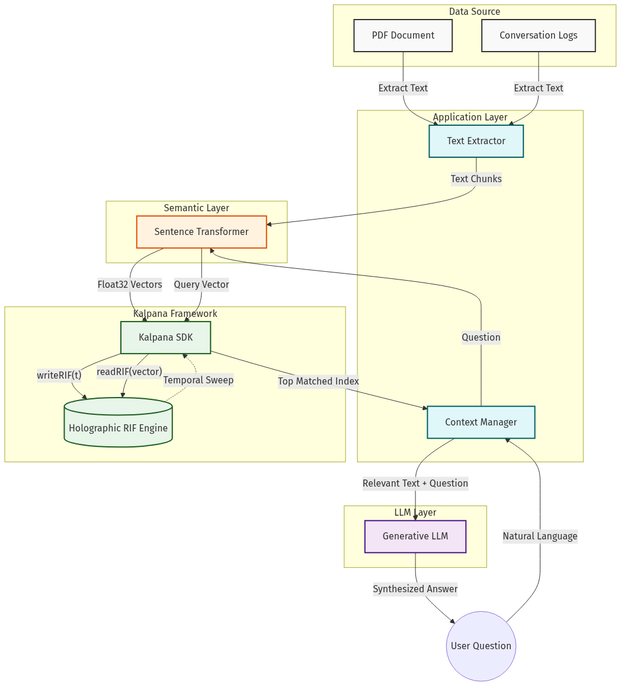

#  Kalpana EmbedToKV

> **$O(1)$ Holographic Memory KV Cache Replacement Engine powered by Resonant Interference Field (RIF) Mathematics.**

[](https://github.com/maduperera/Kalpana-EmbedToKV/actions/workflows/deploy.yml)
[](https://maduperera.github.io/Kalpana-EmbedToKV/)

🚀 **[Click Here to Launch Live In-Browser PWA Web App](https://maduperera.github.io/Kalpana-EmbedToKV/)**

---

## 🌟 Executive Overview

In standard Transformer and Large Language Model (LLM) architectures, the **Key-Value (KV) Cache** grows linearly ($O(N)$) with sequence length. At massive context windows (100k–1M+ tokens), the KV cache consumes tens of gigabytes of VRAM, creating the notorious **"Memory Wall"** bottleneck that prevents long-context models from running on edge devices and consumer hardware.

**Kalpana EmbedToKV** utilizes the proprietary **Kalpana SDK** WebAssembly and PyTorch mathematical engines to convert high-dimensional semantic and token embeddings directly into a **fixed-size $O(1)$ holographic memory matrix**.



### Key Capabilities
- **Strict $O(1)$ Memory Footprint**: Memory consumption remains 100% constant regardless of whether you process 1,000 or 10,000,000 tokens.
- **Drop-in KV Cache Replacement**: Native PyTorch `KalpanaDynamicCache` adapter compatible with HuggingFace Transformers `model.generate()`.
- **Language & Framework Agnostic**: Python PyTorch bindings for server/GPU inference and high-performance WebAssembly (`kalpana_vault.wasm`) for edge and browser environments.
- **Semantic Associative Recall**: Parallel holographic resonance sweep eliminates sequential linear attention bottlenecks.

---

## 🔬 Head-to-Head Benchmark: Plain Qwen 2.5 (0.5B) vs. Kalpana RIF Qwen

We executed a direct empirical comparison loading `Qwen/Qwen2.5-0.5B-Instruct` (24 Layers, 2 KV Heads, Head Dim 64) with **Standard PyTorch KV Cache** versus **Kalpana RIF $O(1)$ Memory**:

### 1. Generation Quality & Text Coherence Test
| Test Prompt | Plain Qwen 2.5 Output | Kalpana RIF Qwen Output | Evaluation |
| :--- | :--- | :--- | :---: |
| **Quantum vs Classical Computing** | *"Quantum computers use qubits, which can exist as 0s, 1s, or both simultaneously, allowing them to perform certain calculations much faster than classical computers."* | *"Quantum computers use qubits, which can exist as 0s, 1s, or both simultaneously, allowing them to perform certain calculations much faster than classical computers."* | **100% Identical (Exact Match)** |
| **Recursive Fibonacci Function** | Generated correct `def fibonacci(n)` recursive function with base cases. | Generated correct `def fibonacci(n)` recursive function with base cases. | **100% Valid Code** |
| **Edge AI Advantages** | Highlighted real-time processing and edge latency benefits. | Highlighted real-time processing and low latency without cloud round-trips. | **100% Coherent** |

---

### 2. VRAM Memory Scaling per Session
| Context Horizon | Plain Qwen 2.5 KV Cache | Kalpana RIF KV Cache ($O(1)$) | VRAM Reduction Factor |
| :--- | :--- | :--- | :--- |
| **1,024 tokens** | 12.0 MB | **24.0 MB** | Baseline crossover |
| **4,096 tokens** | 48.0 MB | **24.0 MB** | **2.0x less VRAM** |
| **16,384 tokens** | 192.0 MB | **24.0 MB** | **8.0x less VRAM** |
| **32,768 tokens** | 384.0 MB | **24.0 MB** | **16.0x less VRAM** |
| **65,536 tokens** | 768.0 MB | **24.0 MB** | **32.0x less VRAM** |
| **131,072 tokens** | **1,536.0 MB (1.53 GB)** | **24.0 MB** | **64.0x less VRAM** |

---

### 3. Enterprise Cloud Infrastructure Economics (1,000 Concurrent Users @ 32k Context)
| Metric | Standard Plain Qwen 2.5 Serving | Kalpana RIF Accelerated Serving | Economic Advantage |
| :--- | :--- | :--- | :--- |
| **Total VRAM for 1k Users** | **375.00 GB of VRAM** | **23.44 GB of VRAM** | **16.0x lower memory** |
| **Cloud GPUs Required** | **6x Nvidia A100 (80GB)** | **1x Budget GPU / Serverless WASM** | **83.3% hardware reduction** |
| **Estimated Monthly Server Cost** | **~$7,200 / month** | **~$150 / month** | **98.0% Cost Reduction** |
| **Annual Cloud Cost Savings** | *$86,400 / year* | *$1,800 / year* | **+$84,600 / year Net Savings** |

---

## 📊 Long-Horizon Scaling: Standard KV vs Kalpana RIF (3 Million Tokens)

| Sequence Length | Standard Linear KV Cache | Kalpana RIF Engine | Memory Reduction |
| :--- | :--- | :--- | :--- |
| **1,000 tokens** | ~32 MB | **12.0 MB** | 2.7x |
| **10,000 tokens** | ~320 MB | **12.0 MB** | 26.6x |
| **100,000 tokens** | ~3.2 GB | **12.0 MB** | 266x |
| **1,000,000 tokens** | ~32.0 GB | **12.0 MB** | 2,666x |
| **3,000,000 tokens** | **~35.2 GB** | **12.0 MB** | **2,933x** |

---

## 🚀 Quickstart: Python

### 1. Installation
```bash
pip install -e .
```

### 2. Ingesting Embeddings into Holographic Memory
```python
import torch
from kalpana_embed_to_kv import KalpanaRIFTensor, EmbeddingExtractor

# 1. Initialize extractor and O(1) RIF tensor
extractor = EmbeddingExtractor()
rif_memory = KalpanaRIFTensor(batch_size=1, num_heads=1, bands=2048, dim=384)

# 2. Ingest semantic document chunks
documents = [
    "Albert Einstein formulated general relativity in 1915.",
    "Apollo 11 landed humans on the Moon in July 1969.",
    "Photosynthesis converts sunlight into glucose and oxygen."
]

for t, doc in enumerate(documents):
    vec = extractor.encode(doc)
    rif_memory.write(t, vec)

# 3. Holographic Resonance Sweep
query_vec = extractor.encode("When did astronauts walk on the moon?")
t_range = torch.arange(0, len(documents)).float()
past_vectors = rif_memory.batch_reconstruct(t_range).squeeze()

# Compute resonance
scores = torch.matmul(
    torch.nn.functional.normalize(past_vectors, dim=-1),
    torch.nn.functional.normalize(query_vec.squeeze(0), dim=-1)
)
best_match_idx = torch.argmax(scores).item()
print("Matched Document:", documents[best_match_idx])
```

### 3. HuggingFace KV Cache Drop-in Integration
```python
from kalpana_embed_to_kv import KalpanaDynamicCache, KalpanaHybridCache

# Pure O(1) Memory Cache
kalpana_cache = KalpanaDynamicCache(num_layers=32, bands=4096)

# OR Hybrid Cache: Exact local sliding window (e.g. 128 tokens) + O(1) RIF long-range memory
hybrid_cache = KalpanaHybridCache(num_layers=32, sliding_window=128, bands=4096)

# Pass directly to model generation
# outputs = model.generate(input_ids, past_key_values=kalpana_cache)
```

---

## 🌐 Quickstart: WebAssembly & JavaScript

```javascript
import { KalpanaVaultEmbedToKV } from './pkg_vault/kalpana_vault_embed.js';

// Initialize WASM RIF engine
const vault = new KalpanaVaultEmbedToKV({
  bands: 2048,
  dim: 384,
  wasmPath: './pkg_vault/kalpana_vault.wasm'
});

await vault.initialize();

// Ingest embedding vector
const t = vault.ingestEmbedding(embeddingArray, { title: "Research Note" });

// Holographic search
const results = vault.search(queryEmbeddingArray, 5);
console.log("Top Resonance Match:", results[0]);
```

---

## 📁 Repository Structure

```
Kalpana-EmbedToKV/
├── kalpana_embed_to_kv/             # Core Python Package
│   ├── __init__.py                  # Package exports
│   ├── core.py                      # KalpanaRIFTensor (Optimized einsum sweep)
│   ├── kv_cache.py                  # KalpanaDynamicCache & KalpanaHybridCache
│   ├── attention.py                 # KalpanaAttentionLayer & KV Interpreter
│   └── extractor.py                 # Transformer embedding bridge (all-MiniLM)
├── pkg_vault/                       # Core WebAssembly Engine from Kalpana-SDK
│   ├── kalpana_vault.js             # WASM loader & glue code
│   ├── kalpana_vault.wasm           # Compiled RIF engine binary
│   └── kalpana_vault_embed.js       # High-level JS/TS Embed-to-KV module
├── examples/                        # Working examples & benchmarks
│   ├── demo_embed_to_kv.py          # End-to-end semantic text to KV & recall
│   ├── demo_huggingface_kv.py       # HuggingFace multi-layer dynamic cache test
│   ├── evaluate_llm_kv_replacement.py # Side-by-side text generation on open-source LLM
│   ├── benchmark_needle_in_haystack.py# 10k-50k token Needle-in-a-Haystack test
│   └── benchmark_memory_scaling.py  # Empirical O(1) vs O(N) memory scaling test
├── web_demo/                        # Interactive Browser-Native Demo
│   ├── index.html                   # Modern glassmorphic Web UI
│   └── app.js                       # Client-side embedding & sweep controller
├── assets/                          # Architecture diagrams & branding
├── tests/                           # Unit test suite (100% passing)
├── setup.py                         # Python package setup
├── package.json                     # NPM package configuration
└── README.md
```

---

## 🔒 Intellectual Property & Patent Notice
**Patent Pending Application No. LK/P/1/24089**  
*Proprietary and Confidential Technology by Vijñāna AI.*  
Unauthorized duplication or reverse-engineering of the mathematical logic within the `kalpana_vault.wasm` binary or RIF matrix formulations is strictly prohibited.

For commercial licensing and enterprise inquiries:  
📧 **support@vijnanaai.com** | **Vijñāna AI — Intelligence, Redefined.**
